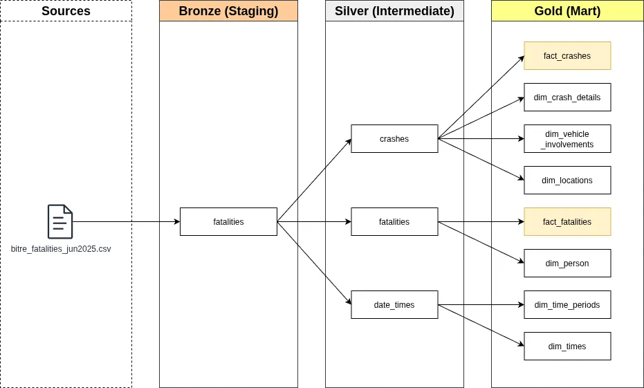
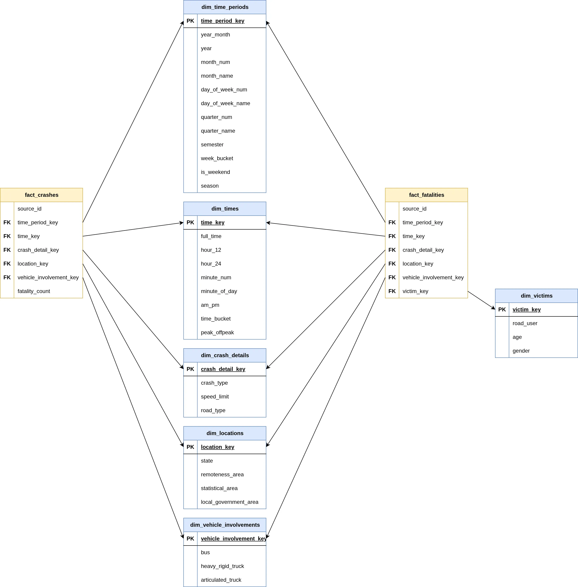
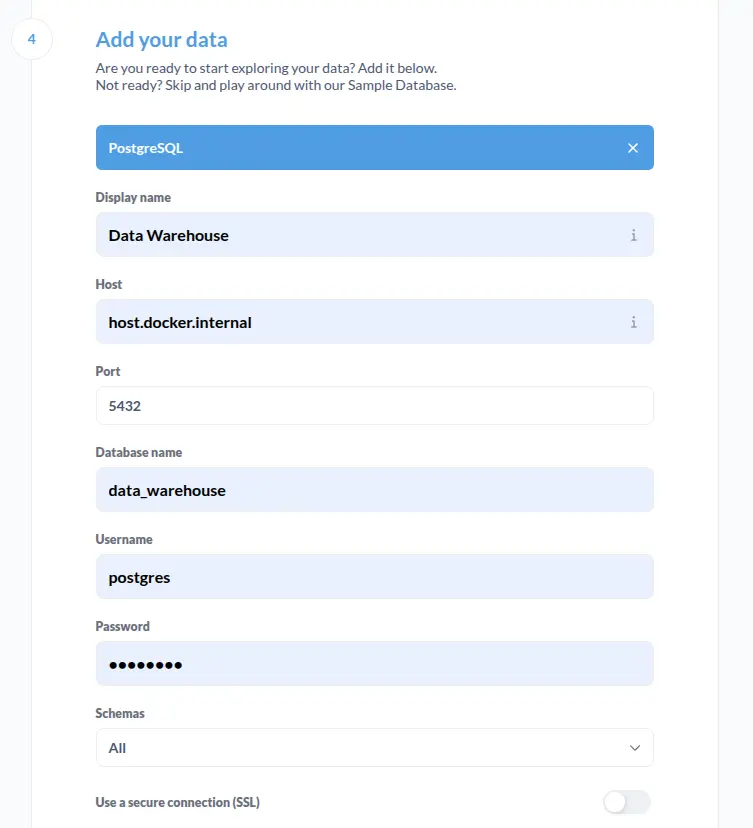
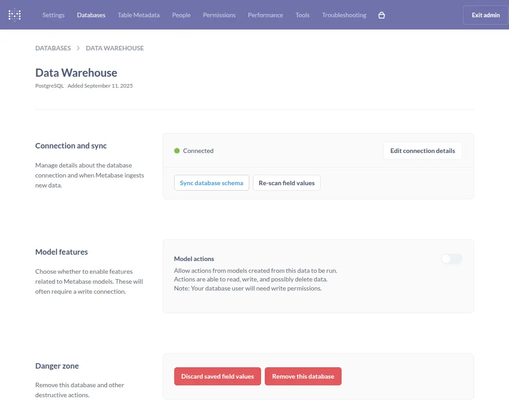
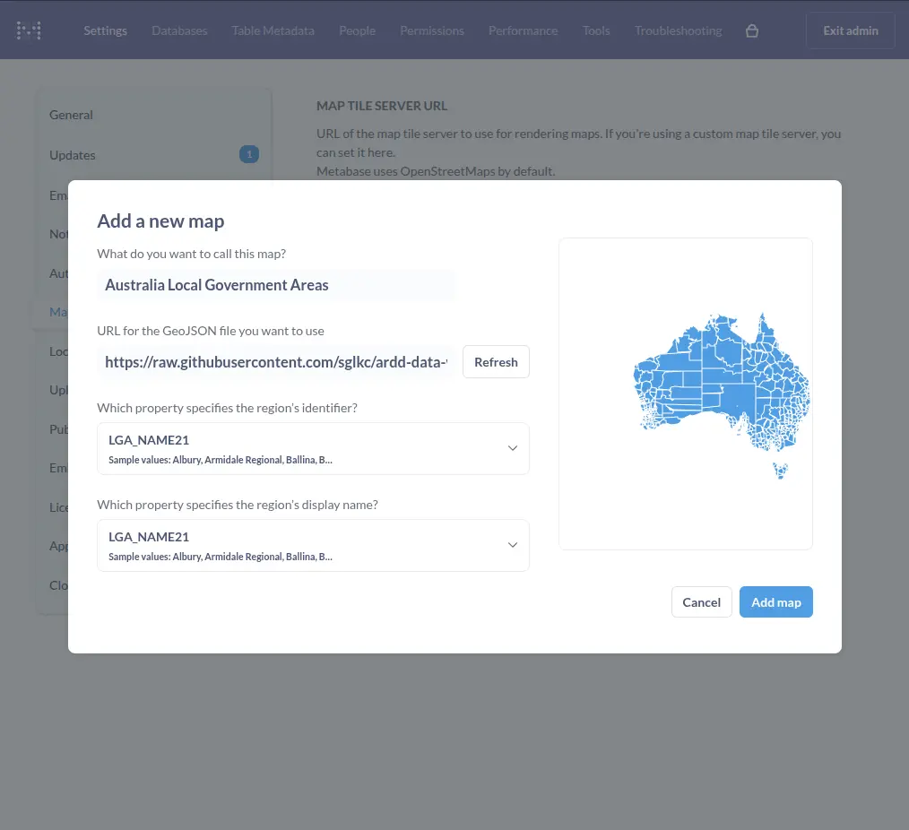

# ARDD Data Warehouse

Internship final project for data warehouse to visualize the Australian Road Deaths Database (ARDD). The project practices task management, data analysis, ETL (extract, transform, load) process, data architect, and probably some CI/CD & DevOps.

## Demonstration

For quick access to the data warehouse, it is currently hosted to a VPS. Plz dont abuse thxx.
Should you find not able to log in, it means that I've changed the credentials and you are out of luck.

<details>
  <summary>Demo Metabase</summary>

- URL: https://metabase.seya.zip
- Email: viewer@metabase.seya.zip
- Password: 6zqbzADTBoRFfM

</details>

## Source Data

The project references a data warehouse project from The University of Western Australia:

https://csse-uwa.gitbook.io/data-warehouse-project-1-s1-2025

The dataset for this project are gathered from the Australian Road Deaths Database (ARDD):

https://datahub.roadsafety.gov.au/progress-reporting/monthly-road-deaths

The GeoJSON data for map visualization in Metabase are downloaded from:

https://csse-uwa.gitbook.io/data-warehouse-project-1-s1-2025#data-sources

with 0.05% Visvalingam simplification to minify the file size via
https://mapshaper.org/

## Project Overview

### Data Architecture

The data warehouse uses [Medallion Architecture](https://www.databricks.com/glossary/medallion-architecture) that consists of three layers:

- **Bronze Layer**: Extracts raw data from source dataset
- **Silver Layer**: Cleaned and validated data with business rules applied
- **Gold Layer**: Analytics-ready models for reporting and business intelligence

### Data Flow

The project handles crashes and fatalities data extracted from the ARDD. Following is the data architecture diagram:



### Data Schema

[Fact constellation](https://www.geeksforgeeks.org/dbms/fact-constellation-in-data-warehouse-modelling/), also known as Galaxy Schema, is the perfect schema design for this particular warehouse. The data processing results in two fact tables and six dimensions, where all facts share the same dimensions, except for `dim_victims` exclusively `fact_fatalities`. The following is the data schema for the final gold layer.



## Technologies

### Prerequisites

- [Git](https://git-scm.com/) for version control
- [Docker](https://docs.docker.com/engine/install/) for containerization
- [uv](https://docs.astral.sh/uv/getting-started/installation/) for Python management
- bash supported environment for scripts

### Setup

You may downlaod the repository archive directly using the URL:

https://github.com/sglkc/data-warehouse/archive/refs/heads/master.zip

or clone with git:

```sh
git clone https://github.com/sglkc/ardd-data-warehouse.git && cd ardd-data-warehouse
```

Before running, you must set up environment variables for the project:

```sh
cp .env.example .env
```

The variables are ready for development, but it can be customized.

### Python

The project uses uv for Python version and package management, make sure you already had it installed.

- Create virtual env with uv

  ```sh
  uv venv
  ```

- Activate virtual env

  ```sh
  source .venv/bin/activate
  ```

- Sync Python packages

  ```sh
  uv sync
  ```

### Docker

The project uses Docker for containerization, the services used are:

- PostgreSQL, as database for data warehouse
- pgweb, for web-based database browser
- Metabase, as front-end for data warehouse

To run these services inside Docker, run:

```sh
./compose.sh up
```

To stop the services, run:

```sh
./compose.sh down
```

To clean up everything, including container data, run:

```sh
./compose.sh cleanup
```

The script should be executable by default, if not, run:

```sh
chmod +x ./compose.sh
```

### PostgreSQL

By default, the credentials for containerized database should be:

- Host: localhost
- Port: 5432
- User: postgres
- Password: securedb123
- Database: data_warehouse

Please refer to your .env file, should you change any of the defaults.

### Metabase

Upon running the `compose up` script, you will have to wait for Metabase to start.
This process should take a minute, though the logs can be seen with:

```
docker logs ${PROJECT_NAME}_metabase -f
```

Adapt `PROJECT_NAME` to your environment variable, by default, it's `au_crashes`.

On first start up, you will be required to create an admin account to access Metabase.
Follow the process and input anything. On the 4th step, you should pick PostgreSQL and enter the database credentials.

If you use the database locally, you must replace `localhost` with `host.docker.internal`.

<details>
  <summary>Setup PostgreSQL data warehouse in Metabase</summary>

  

</details>

#### Refreshing Metabase Data

If you have ran Metabase before executing the data pipeline, you would probably need to refresh the database schema and field values.

To do this, head to: http://localhost:3000/admin/databases/

<details>
  <summary>Refresh data warehouse in Metabase</summary>

  

</details>

#### Adding custom maps to Metabase

Metabase by default only ship with [US and World map](https://www.metabase.com/docs/latest/questions/visualizations/map).

To add Australian regions to the map visualization:

- Head to http://localhost:3000/admin/settings/maps
- Click on `Add a map`
- Name the map "Australian Local Government Area" with the URL
https://raw.githubusercontent.com/sglkc/ardd-data-warehouse/refs/heads/master/docs/geojson/LGA_2021_AUST_GDA94.json
- Then follow the image below.

<details>
  <summary>Loading custom maps in Metabase</summary>

  

</details>

### dlt

The project utilizes [dlt](https://dlthub.com/) (data load tool) to extract file datasets into the data warehouse bronze layer.

To load the source datasets into the data warehouse, run the following script with additional source name:

```sh
./dlt.sh <all|fatalities-jun|fatalities-jul|lga|ra|sa4|dwellings|population>
```

### SQLMesh

As for the transform and load (TL) process, the project uses [SQLMesh](https://sqlmesh.readthedocs.io/en/stable/) in the silver and gold layer.

To apply model changes to the data warehouse, run the following script:

```
./sqlmesh.sh
```

## Troubleshooting

If you encountered `Failed to build psycopg2==2.9.10` on uv sync, you must install the libpq library to build it.

```sh
sudo apt-get install libpq-dev
```

## Expanding the project

There are more publicly available datasets from Australian Bureau of Statistics that may be used to expand this project to a larger data warehouse:

https://www.abs.gov.au/statistics

The [population datasets](https://www.abs.gov.au/statistics/people/population) are very helpful to know territory populations and death counts.

## License

You may contribute or fork this repository, please feel free to use this to learn!
