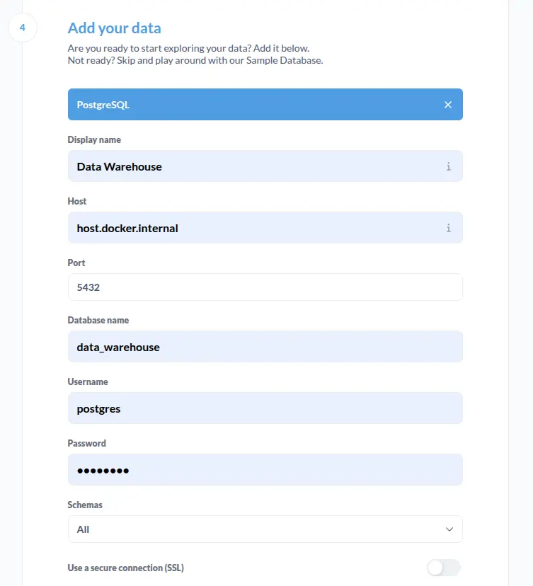

# Data Warehouse

Intern project for data warehouse. TODO: more info here

## Source Data

The project references a data warehouse project from The University of Western Australia:

https://csse-uwa.gitbook.io/data-warehouse-project-1-s1-2025

The dataset for this project are gathered from the Australian Road Deaths Database (ARDD):

https://datahub.roadsafety.gov.au/progress-reporting/monthly-road-deaths

Other complementing dataset such as `RA_2021_AUST` and `LGA_2021_AUST` are downloaded from:

https://www.abs.gov.au/statistics/standards/australian-statistical-geography-standard-asgs-edition-3/jul2021-jun2026/access-and-downloads/allocation-files

## Prerequisites

- [Docker](https://docs.docker.com/engine/install/) for containerization
- [uv](https://docs.astral.sh/uv/getting-started/installation/) for Python management
- bash supported environment for scripts

Before running, you must set up environment variables for the project:

```sh
cp .env.example .env
```

The variables are ready for development, but it can be customized.

## Python

The project uses uv for Python version and package management, make sure you already had it installed.

- Create virtual env with uv

  ```sh
  uv venv
  ```

- Activate virtual env

  ```sh
  source .venv/bin/activate
  ```

- Sync Python packages

  ```sh
  uv sync
  ```

## Docker

The project uses Docker for containerization, the services used are:

- PostgreSQL, as database for data warehouse
- pgweb, for web-based database browser
- Metabase, as front-end for data warehouse

To run these services inside Docker, run:

```sh
./compose.sh up
```

To stop the services, run:

```sh
./compose.sh down
```

To clean up everything, including container data, run:

```sh
./compose.sh cleanup
```

The script should be executable by default, if not, run:

```sh
chmod +x ./compose.sh
```

## PostgreSQL

By default, the credentials for containerized database should be:

- Host: localhost
- Port: 5432
- User: postgres
- Password: securedb123
- Database: data_warehouse

Please refer to your .env file, should you change any of the defaults.

## Metabase

Upon running the `compose up` script, you will have to wait for Metabase to start.
This process should take a minute, though the logs can be seen with:

```
docker logs ${PROJECT_NAME}_metabase -f
```

Adapt `PROJECT_NAME` to your environment variable, by default, it's `au_crashes`.

On first start up, you will be required to create an admin account to access Metabase.
Follow the process and input anything. On the 4th step, you should pick PostgreSQL and enter the database credentials.

If you use the database locally, you must replace `localhost` with `host.docker.internal`.


